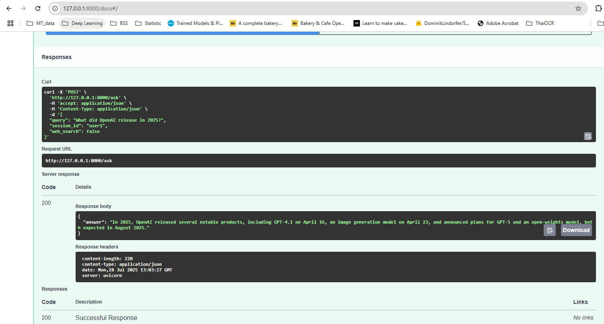

# chat_with_pdfs

## Overview
This is a backend system for intelligent question-answering over a corpus of academic PDFs, with support for web searches for out-of-scope queries. It uses a multi-agent architecture with LangGraph, RAG for PDF-based answers, and FastAPI for the RESTful API.

### Main Features
- **PDF-Based Question Answering**: The system answers queries about academic papers by retrieving relevant content from ingested PDFs stored in a Chroma vector database.
- **Manual and Automatic Web Search Integration**: Users can manually trigger web searches for external information (e.g., GitHub links) using the web_search parameter in API requests, with automatic routing for certain queries.
- **Session Memory for Contextual Queries**: The system maintains session history to resolve contextual references (e.g., "that paper") across multiple user queries.


### How to Run Locally
1. **Prerequisites**:
   - Docker and docker-compose installed.
   - Environment variables: `OPENAI_API_KEY`, `TAVILY_API_KEY` in a `.env` file.
   - Place PDF files in the `data/` directory.

2. **Steps**:
   ```bash
   # Build and start the container
   docker-compose up --build

   # Ingest PDFs (run in a separate terminal)
   docker exec -it <container_name> python scripts/ingest_pdfs.py

3. **Test API**:
   ```bash
   curl -X POST http://localhost:8000/ask -H "Content-Type: application/json" -d '{"query": "Which prompt template gave the highest zero-shot accuracy on Spider in Zhang et al. (2024)?", "session_id": "user1", "web_search": false}'
   curl -X POST http://localhost:8000/clear_memory -H "Content-Type: application/json" -d '{"session_id": "user1"}'


### Architecture
- **PDF Ingestion**: Extracts text from PDFs using `pypdf` and stores embeddings in Chroma.
- **Clarification Agent**: Detects vague queries and clarifies them by looking at conversation history.
- **Routing Agent**: Decides whether to use PDF retrieval or web search.
- **Retrieval Agent**: Uses LangChain and Chroma for RAG-based answers from PDFs.
- **Web Search Agent**: Uses Tavily API for external queries.
- **Answer Generation Agent**: Combines context and conversation history to generate answers.
- **Memory Manager**: Maintains session-based conversation history.


### Tech Stack

The following table outlines the technologies used in this project, categorized by their role and purpose in the question-answering chatbot system.

| **Category**              | **Technology**                     | **Purpose**                                                                 |
|---------------------------|------------------------------------|-----------------------------------------------------------------------------|
| Programming Language      | Python (3.11)                       | Core language for all scripts and logic implementation.                     |
| Web Framework             | FastAPI                            | RESTful API for `/ask` and `/clear_memory` endpoints, with async support.   |
| AI/NLP Libraries          | LangChain                          | Document loading, text splitting, and retrieval for question-answering.     |
| AI/NLP Libraries          | LangGraph                          | Orchestrates multi-agent workflow (Clarification, Routing, Retrieval, Answer). |
| AI Models                 | OpenAI (gpt-4o-mini, embeddings)   | Language model for query processing, embeddings for text vectorization.      |
| Web Search API            | Tavily API                         | Web searches for external information (e.g., GitHub repository links).       |
| Vector Database           | Chroma                             | Stores and queries embedded PDF chunks for paper-related queries.           |
| Document Processing       | PyPDF2 (PyPDFLoader)               | Extracts text from academic PDFs for ingestion.                             |
| Document Processing       | RecursiveCharacterTextSplitter     | Splits PDF text into chunks for embedding and retrieval.                    |
| Session Management        | Custom MemoryManager               | In-memory session history storage, extensible to Redis or SQLite.           |
| Deployment                | Docker                             | Containerizes the application for consistent deployment.                    |
| Deployment                | Docker Compose                     | Orchestrates FastAPI server and potential services (e.g., Redis).           |
| Dependency Management     | pip, requirements.txt              | Manages dependencies like `fastapi`, `langchain`, `chromadb`.               |
| Configuration             | Environment Variables              | Manages API keys (e.g., Tavily, OpenAI) and configuration settings.         |
| Development Tools         | Uvicorn                            | ASGI server for running the FastAPI application.                            |
| Development Tools         | re (Regular Expressions)           | Parses paper titles or arXiv IDs from session history or queries.           |


### Future Improvements
- Implement recursive storing to new incoming data.
- Add an evaluation system with golden Q&A pairs and confidence scoring.
- Optimize vector store performance with batch processing.
- Improve error handling and logging for production readiness.

### Trade-offs
- Used Chroma for simplicity; alternatives like Pinecone could scale better.
- In-memory memory manager; a database like SQLite would be more robust.
- Focused on a vertical slice to demonstrate core functionality within time constraints.


### Demo
